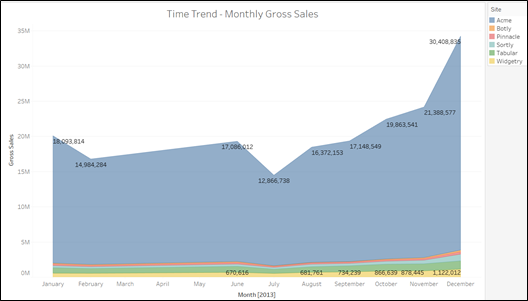
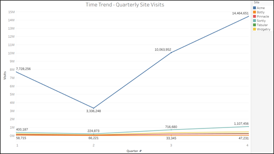
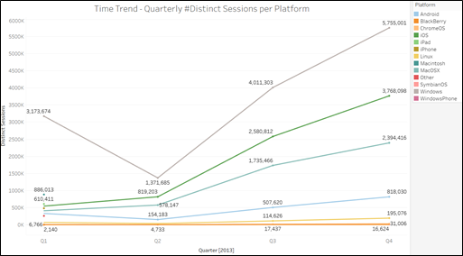
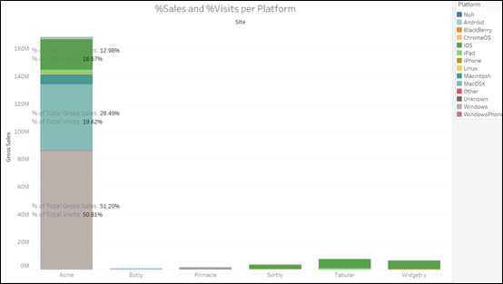
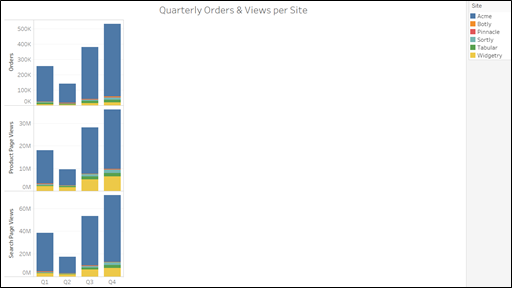
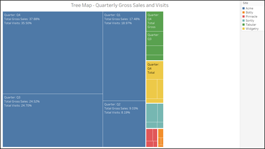
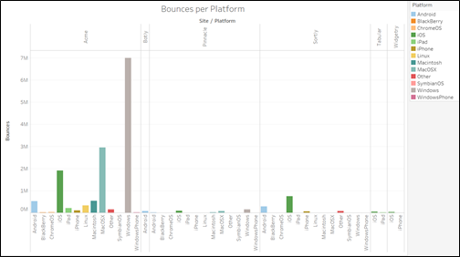
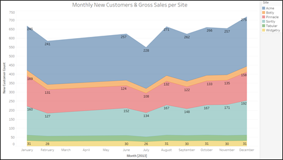
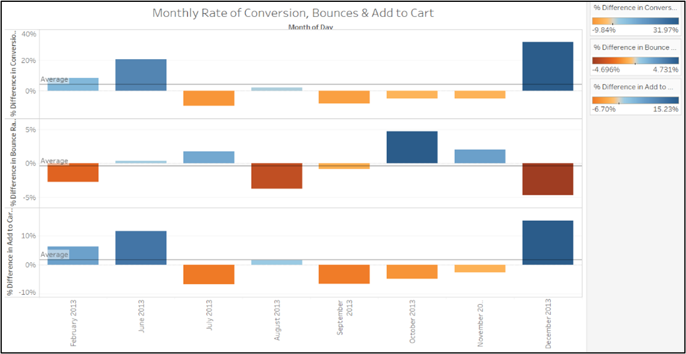

# E-commerce-Website-Analytics

The dataset is about e-commerce websites describing details about daily new customers, web-visits, views, orders, sales, etc. for each platform.

## Dataset

Following are the details about each field in the dataset: 

1.	day	The calendar day

2.	site	Company site visited by users

3.	new_customer	0 = returning customer; 1 = new customer; null = neither

4.	platform	The type of device used by a website visitor

5.	visits	The number of distinct website visits; 1 session may have multiple visits

6.	distinct_sessions	The number of distinct website visitors; 1 session may have multiple visits

7.	orders	The number of website orders

8.	gross_sales	The total gross sales for website orders

9.	bounces	The number of visits that only viewed one page

10.	add_to_cart	The number of visits that added a product to cart

11.	product_page_views	The number of product pages viewed

12.	search_page_views	The number of search pages viewed

## Visualizations

### 1. Time Trend - Monthly Gross Sales

Shows a monthly trend in the Total Gross Sales per Site. The Density chart shows Acme site to be the leader in Gross sales over the entire period.

### 2. Time Trend - Quarterly Site Visits

The line provides a time trend in the Quarterly Site visits for each Site. From the chart, we can say that Acme has higher no. of visits every quarter and Botly has least no. of visits.

### 3. Time Trend - Quarterly #Distinct Sessions per Platform

The line chart shows the trend of No. of Distinct Sessions per platform for each quarter. From the graph, it is clear that the Windows platform is most prevalent in the market whereas Blackberry platform is the least popular.

### 4. %Sales and %Visits per Platform

The stacked bars show total gross sales for each site and platform. Moreover, it also shows labels of percentage of gross sales for every percentage of visits. From this we can conclude that the gross sales are directly proportional to the visits made. 

### 5. Quarterly Orders & Views per Site

The stacked bars show trends of each Orders, Product Page views, and Search Page Views for each Quarter per Site. From the visualization, it is clear all metrics show a dip in Q2 but a gradual recovery in subsequent quarters Q3 & Q4. 

### 6. Tree Map - Quarterly Gross Sales and Visits

This is a tree map that shows quarterly magnitude of gross sales and visits for each Site. The graph shows Acme to be leading in visits and gross sales, with quarter Q4 with most figures and Q2 with least readings.

### 7. Bounces per Platform

The bar chart shows bounces of each Site and Platform. With more visits and gross sales, Acme also has highest no. of bounces. The Gross sales also depend on the site available on no. of platforms for the customers. Hence, the gross sales is also directly dependent on platform count. 

### 8. Monthly New Customers & Gross Sales per Site

The area chart shows a monthly new customer count and gross sales per site. Acme has the highest no. of new customers whereas widgetry has the least no. of new customers turnup.

### 9. Monthly Rate of Conversion, Bounces & Add to Cart

The bar chart shows monthly differences between percent of Conversion rate, Bounce Rate & Add to Cart Rate over previous month rate. 

Each rate is calculated as below:

- Conversion Rate = Orders / Visits
- Bounce Rate = Bounces / Visits
- Add to Cart Rate = Add to Cart / Visits

All the above sheets form 3 different Dashboards. These 3 dashboards are added to form a story. From the above visualizations, we can summarize Visits, Bounces, and no. of platforms as significant features in increasing site’s gross sales. The underperforming sites can focus on increasing unique visits and new customers by attractive offers. Also, such sites must also diversify their business over various platforms to make it available to a large diaspora of customers.
